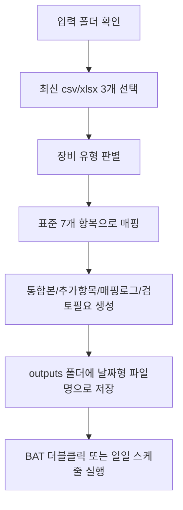

# 04. 실험데이터 통합 자동화 시나리오

## 문서 목적

이 문서는 서로 다른 장비에서 나온 실험 결과 파일을 하나로 통합하는 업무를 예시로, 프롬프트 작성과 실제 자동화 설계의 차이를 설명하기 위한 시나리오다.

## 상황 가정

- 같은 실험 결과가 장비 A, B, C에서 각각 생성된다.
- 파일 형식은 `csv`와 `xlsx`가 섞여 있다.
- 최종 통합 기준이 되는 공통 항목은 7개다.
- 장비마다 컬럼명은 다르지만 의미는 겹친다.
- 장비별 추가 컬럼도 함께 존재한다.

공통 기준 7개는 아래와 같다.

1. `sample_id`
2. `experiment_date`
3. `operator`
4. `device_id`
5. `result_value`
6. `signal_strength`
7. `quality_score`

## 컬럼 매핑 예시

| 표준 항목 | 장비 A | 장비 B | 장비 C |
| --- | --- | --- | --- |
| `sample_id` | `Sample No` | `specimen_id` | `sample_code` |
| `experiment_date` | `Measured At` | `run_date` | `test_day` |
| `operator` | `User` | `analyst` | `technician` |
| `device_id` | `Equipment` | `instrument_name` | `machine_id` |
| `result_value` | `Result` | `final_value` | `outcome_value` |
| `signal_strength` | `Signal` | `intensity` | `peak_signal` |
| `quality_score` | `QC Score` | `quality_index` | `score_qc` |

장비별 추가 컬럼 예시는 아래처럼 볼 수 있다.

- 장비 A: `Ambient Temp (C)`, `Operator Note`
- 장비 B: `Calibration Batch`, `Review Flag`
- 장비 C: `Reagent Lot`, `Plate ID`

## 프롬프트만으로 끝나면 왜 자동화가 아닌가

예를 들어 아래와 같은 프롬프트는 병합 규칙을 설명하는 데는 유용하다.

`폴더 안의 실험데이터 3개 파일을 읽어서 공통 7개 표준 항목 기준으로 하나의 xlsx로 통합해줘. 컬럼명이 다르면 자동 매핑하고, 검토가 필요한 항목은 별도 시트로 정리해줘.`

하지만 이 상태는 아직 자동화라기보다 작업 지시문에 가깝다.

실제 자동화라면 아래가 함께 정의되어야 한다.

- 어떤 폴더에서 파일을 가져오는가
- 최신 파일 3개를 어떤 기준으로 고르는가
- 언제 실행되는가
- 사용자가 필요할 때 어떻게 수동 실행하는가
- 결과 파일을 어디에 어떤 이름으로 저장하는가

즉, 자동화는 프롬프트가 아니라 `입력 + 실행 트리거 + 출력`까지 연결되어야 한다.

## 이 폴더에서의 자동화 정의

이 예제 폴더에서는 자동화를 아래처럼 정의한다.

- 입력: `samples` 폴더에서 최신 `csv/xlsx` 3개 선택
- 처리: 장비별 컬럼명을 표준 7개 항목으로 매핑해 통합
- 출력: `outputs` 폴더에 날짜가 붙은 xlsx 저장
- 수동 실행: `실험데이터_통합_실행.bat` 더블클릭
- 정기 실행: Windows 작업 스케줄러에 배치 파일 또는 PowerShell 스크립트 등록

## 수업 진행 방식 제안

이 주제는 처음부터 절차만 따라하게 하기보다, 먼저 자유롭게 생각해 보게 한 뒤 구조화된 실습으로 넘어가는 방식이 더 효과적이다.

### 1. 먼저 자유 탐색

학습자에게 바로 정답 절차를 주지 않고 먼저 생각하게 한다.

예시 질문:

1. 이 상태를 정말 자동화라고 부를 수 있을까
2. 최신 파일 3개는 어떤 기준으로 골라야 할까
3. 사용자는 어떤 방식으로 실행해야 가장 편할까
4. 결과 파일은 어디에 어떤 이름으로 저장돼야 할까
5. 사용자가 미리 지켜야 하는 규칙은 무엇일까

이 단계의 목적은 코드를 맞히게 하는 것이 아니라, 자동화의 구성 요소를 스스로 떠올리게 하는 데 있다.

### 2. 그 다음 단계별 실습

자유 탐색 후에는 아래 순서로 구조화된 실습을 진행한다.

1. 공통 7개 표준 항목 정의하기
2. 장비별 컬럼 매핑 규칙 확인하기
3. 샘플 파일명 규칙 정하기
4. `samples`와 `outputs` 폴더 역할 이해하기
5. Node.js가 왜 필요한지 이해하기
6. `실험데이터_통합_실행.bat`로 직접 실행해 보기
7. 결과 파일과 `검토필요` 시트 확인하기
8. 매일 자동 실행하려면 무엇을 추가해야 하는지 이야기하기

즉 `생각은 자유롭게, 실행은 단계적으로`가 이 수업에 가장 잘 맞는다.

## 기대 결과물

생성되는 통합 파일은 다음 시트로 구성한다.

### 1. `통합본`

- 공통 7개 표준 항목 중심의 통합 결과
- 어느 장비에서 들어온 데이터인지 `source_device` 포함

### 2. `장비별추가항목`

- 장비별로만 존재하는 부가 컬럼 보존

### 3. `매핑로그`

- 어떤 원본 컬럼이 어떤 표준 컬럼으로 매핑되었는지 기록

### 4. `검토필요`

- 필수 항목 누락
- 매핑 실패
- 빈 파일
- 중복 장비 파일 등 검토가 필요한 내용 기록

## 실제 자동화 흐름

## 강의에서 강조하면 좋은 메시지

- 프롬프트는 규칙을 설명하는 출발점이다.
- 자동화는 사람이 매번 지시하지 않아도 같은 규칙으로 반복 실행되는 구조다.
- 사용자 편의를 높이려면 PowerShell 명령 입력보다 BAT 더블클릭 같은 쉬운 진입점을 제공하는 것이 좋다.
- 수업도 처음부터 매뉴얼만 따라가기보다, 먼저 생각하게 하고 그 다음 구조화하는 편이 학습 효과가 좋다.

## 요약

이 사례는 프롬프트만 잘 쓰는 것으로 끝나면 부족하고, 적어도 `최신 파일 3개 자동 선택`, `BAT 더블클릭 실행`, `매일 자동 실행`, `결과 파일 자동 저장` 수준까지 이어져야 업무 자동화라고 부르기 더 적절하다. 교육 방식도 `자유 탐색 후 단계별 실습` 흐름이 가장 잘 맞는다.
